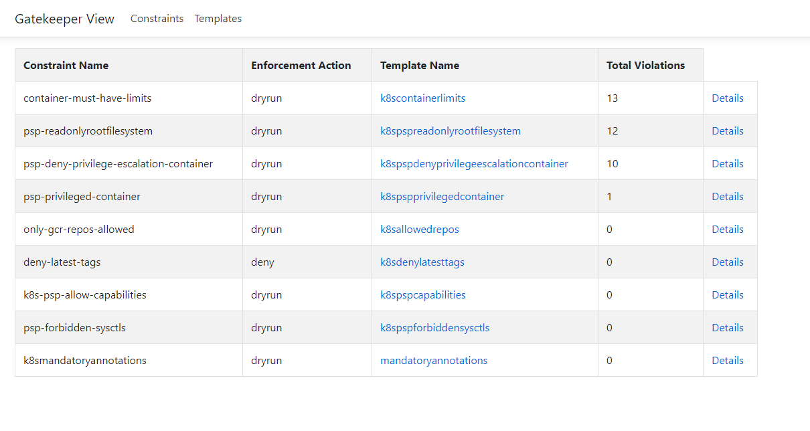
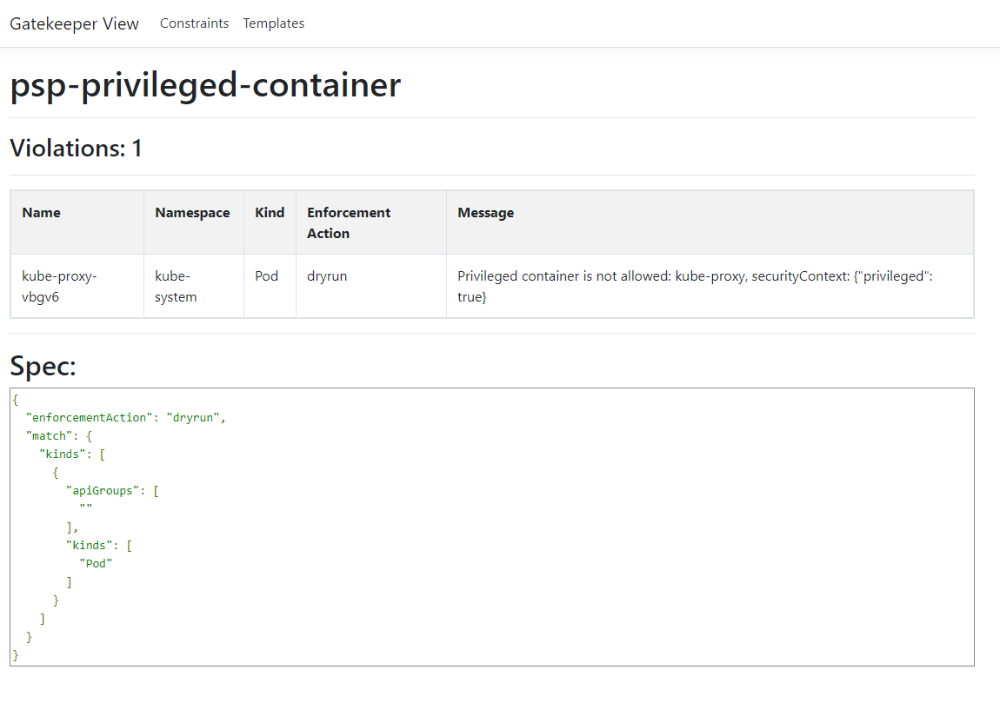
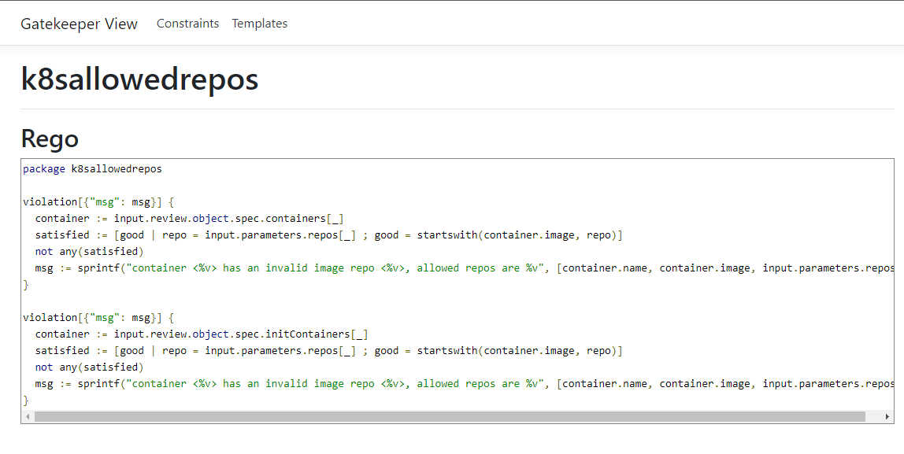

# Gatekeeper UI

A simple web interface to view the constraints, violations and templates of [Gatekeeper (Open policy agent)](https://github.com/open-policy-agent/gatekeeper) policies deployed in the cluster. The web interface is not integrated with any authentication or authorization and assumes would be run using port-forward only.

## Deploying on cluster

To deploy the application on your cluster, you would first need to deploy the OPA Gatekeeper on your cluster. Once you have the required CRDs you can deploy the application using the following command.

```bash
kubectl apply -k deploy
```
This would deploy the application in the ```gatekeeper-system``` namespace, same as the OPA gatekeeeper, once its deployed the application is exposed on 8080 and you can run port forward to access the web interface.

```bash
kubectl port-forward svc/gatekeeper-ui -n gatekeeper-system 8080:8080
```
## Sample screenshots

### Home page with Constraints



### Constraint Details page



### Templates List page


### Template Details page

